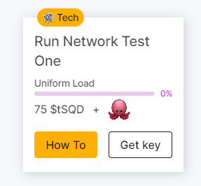

# 📌 feed

* https://app.subsquid.io/quests adresine gidiyoruz ve **Get Key** tuşuna basıp, keyi indiriyoruz.

<figure><figcaption></figcaption></figure>

* https://github.com/codespaces e gidip. Blank - Use this template’e basıyoruz. Biraz bekledikten sonra terminal ekranı açılacak.

<figure><figcaption></figcaption></figure>

*   Aşağıdaki yönergeleri takip edin.

    ```jsx
    npm install --global @subsquid/cli@latest

    sqd --version
    ## @subsquid/cli/2.8.0 linux-x64 node-v20.5.1 ## böyle bir çıktı vermesi gerekir.

    sqd init uniform-load-squid -t https://github.com/subsquid-quests/network-test-one-uniform-load-squid

    cd uniform-load-squid

    ## get key tuşuna basıp indirdiğimiz dosyayı; (networkTestOneUniformLoad.key) 
    ./query-gateway/keys klasörüne sağ tuş - Karşıya Yükleme tuşuna basarak yükleyin.

    sqd get-peer-id  ## peer id aşağıdaki adımda kullanacağız.

    [**Bu sayfaya**](https://app.subsquid.io/profile/gateways/add?testnet) giderek gerekli alanları dolduralım. Publicly available - kapalı kalacak.

    Yukarıdaki işlem tamamlandıktan sonra [**bu sayfaya**](https://app.subsquid.io/profile/gateways?testnet) yönlendirilmiş olmanız gerekiyor. CU al
    tuşuna basıp 10tSQD kilitliyoruz. 
    ```
* Yukarıdaki adımları tamamladıktan sonra en son yönlendirildiğimiz sayfada **Pending Lock** tarafında olan tSQD lerin **Locked** tarafına geçmesini bekliyoruz. Bu yaklaşık 15 dakika kadar sürebiliyor.

<figure><figcaption></figcaption></figure>

*   tSQD’lerimiz Locked tarafına geçtikten sonra terminale dönüp aşağıdaki işlemleri yapıyoruz.

    ```jsx
    sqd up

    sqd build

    sqd run .

    ## aşağıdakine benzer bir çıktı alıyor olmamız gerekiyor.
    [eth-processor] {"level":2,"time":1705681499120,"ns":"sqd:commands","msg":"PROCESS:ETH"}
    [moonbeam-processor] {"level":2,"time":1705681499148,"ns":"sqd:commands","msg":"PROCESS:MOONBEAM"}
    [base-processor] {"level":2,"time":1705681499155,"ns":"sqd:commands","msg":"PROCESS:BASE"}
    [bsc-processor] {"level":2,"time":1705681499163,"ns":"sqd:commands","msg":"PROCESS:BSC"}
    [eth-processor] 01:24:59 INFO  sqd:processor processing blocks from 955722
    [base-processor] 01:24:59 INFO  sqd:processor processing blocks from 1208926
    [moonbeam-processor] 01:24:59 INFO  sqd:processor processing blocks from 166845
    [bsc-processor] 01:24:59 INFO  sqd:processor processing blocks from 16996735
    [eth-processor] 01:24:59 INFO  sqd:processor using archive data source
    [eth-processor] 01:24:59 INFO  sqd:processor prometheus metrics are served at port 34253
    [base-processor] 01:24:59 INFO  sqd:processor using archive data source
    [base-processor] 01:24:59 INFO  sqd:processor prometheus metrics are served at port 40205
    [moonbeam-processor] 01:24:59 INFO  sqd:processor using archive data source
    [moonbeam-processor] 01:24:59 INFO  sqd:processor prometheus metrics are served at port 33691
    [bsc-processor] 01:24:59 INFO  sqd:processor using archive data source
    [bsc-processor] 01:24:59 INFO  sqd:processor prometheus metrics are served at port 41199
    [moonbeam-processor] 01:25:00 INFO  sqd:processor:mapping Got 0 burn txs and 0 USDT transfers
    [moonbeam-processor] 01:25:00 INFO  sqd:processor 171971 / 5325985, rate: 3823 blocks/sec, mapping: 2729 blocks/sec, 1364 items/sec, eta: 23m
    [base-processor] 01:25:00 INFO  sqd:processor:mapping Got 0 burn txs and 0 USDT transfers
    [base-processor] 01:25:00 INFO  sqd:processor 1477379 / 9442733, rate: 175758 blocks/sec, mapping: 8032 blocks/sec, 1339 items/sec, eta: 45s
    [base-processor] 01:25:02 INFO  sqd:processor:mapping Got 1 burn txs and 0 USDT transfers
    ```
* Ardından Dashboard kısmına dönüp, görevin altındaki % nin tamamlanmasını beklemek kalıyor. Tamamlandıktan sonra claim ediyoruz.

<figure><figcaption></figcaption></figure>

*   Görevimiz tamamlandıktan sonra terminale dönüyoruz ve **ctrl c** tuşuna basıyoruz ve aşağıdaki komutu yazıyoruz.

    ```jsx
    sqd down
    ```
* Son olarak Codespaces blank dediğimiz ekrana gidip kullandığımız terminali siliyoruz ve tamamdır.

<figure><figcaption></figcaption></figure>
