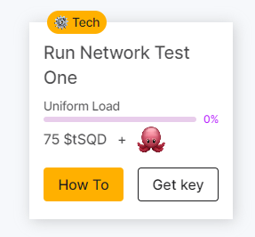

# Subsquid

#### **Subsquid Hakkında**


[**Twitter**](https://twitter.com/subsquid) **|** [**Github**](https://github.com/subsquid) **|** [**Website**](https://subsquid.io/) **|** [**Discord**](https://discord.gg/subsquid) **|** [**Telegram**](https://t.me/subsquid) **|** [**Docs**](https://docs.subsquid.io/) **|** [**Explorer**](https://docs.subsquid.io/squid-cli/explorer/)



**Subsquid Network,** büyük hacimli verilerin toplu olarak çıkarılması için optimize edilmiş merkezi olmayan bir sorgu motorudur. Şu anda 100'den fazla [EVM](https://docs.subsquid.io/subsquid-network/reference/evm-networks) ve [Substrate](https://docs.subsquid.io/subsquid-network/reference/substrate-networks) ağının yanı sıra [Starknet'ten](https://docs.subsquid.io/subsquid-network/reference/starknet-api) alınan geçmiş zincir içi verileri sunmaktadır . Veriler kapsamlıdır: örneğin EVM'de olay günlükleri, işlem makbuzları, izlemeler ve işlem başına durum farkları bulunur.


***

<details>

<summary>Run Network Test One</summary>

* https://app.subsquid.io/quests adresine gidiyoruz ve **Get Key** tuşuna basıp, keyi indiriyoruz.



* https://github.com/codespaces e gidip. Blank - Use this template’e basıyoruz. Biraz bekledikten sonra terminal ekranı açılacak.


*   Aşağıdaki yönergeleri takip edin.

    <pre class="language-jsx"><code class="lang-jsx">npm install --global @subsquid/cli@latest

    sqd --version
    ## @subsquid/cli/2.8.0 linux-x64 node-v20.5.1 ## böyle bir çıktı vermesi gerekir.

    sqd init uniform-load-squid -t https://github.com/subsquid-quests/network-test-one-uniform-load-squid

    cd uniform-load-squid

    npm ci

    ## get key tuşuna basıp indirdiğimiz dosyayı; (networkTestOneUniformLoad.key) 
    ./query-gateway/keys klasörüne sağ tuş - Karşıya Yükleme tuşuna basarak yükleyin.

    sqd get-peer-id  ## peer id aşağıdaki adımda kullanacağız.

    <a data-footnote-ref href="#user-content-fn-1">Bu sayfaya</a> giderek gerekli alanları dolduralım. Publicly available - kapalı kalacak.

    Yukarıdaki işlem tamamlandıktan sonra <a data-footnote-ref href="#user-content-fn-2">bu sayfaya</a> yönlendirilmiş olmanız gerekiyor. CU al
    tuşuna basıp 10tSQD kilitliyoruz. 
    </code></pre>
* Yukarıdaki adımları tamamladıktan sonra en son yönlendirildiğimiz sayfada **Pending Lock** tarafında olan tSQD lerin **Locked** tarafına geçmesini bekliyoruz. Bu yaklaşık 15 dakika kadar sürebiliyor.


*   tSQD’lerimiz Locked tarafına geçtikten sonra terminale dönüp aşağıdaki işlemleri yapıyoruz.

    ```jsx
    sqd up

    sqd build

    sqd run .

    ## aşağıdakine benzer bir çıktı alıyor olmamız gerekiyor.
    [eth-processor] {"level":2,"time":1705681499120,"ns":"sqd:commands","msg":"PROCESS:ETH"}
    [moonbeam-processor] {"level":2,"time":1705681499148,"ns":"sqd:commands","msg":"PROCESS:MOONBEAM"}
    [base-processor] {"level":2,"time":1705681499155,"ns":"sqd:commands","msg":"PROCESS:BASE"}
    [bsc-processor] {"level":2,"time":1705681499163,"ns":"sqd:commands","msg":"PROCESS:BSC"}
    [eth-processor] 01:24:59 INFO  sqd:processor processing blocks from 955722
    [base-processor] 01:24:59 INFO  sqd:processor processing blocks from 1208926
    [moonbeam-processor] 01:24:59 INFO  sqd:processor processing blocks from 166845
    [bsc-processor] 01:24:59 INFO  sqd:processor processing blocks from 16996735
    [eth-processor] 01:24:59 INFO  sqd:processor using archive data source
    [eth-processor] 01:24:59 INFO  sqd:processor prometheus metrics are served at port 34253
    [base-processor] 01:24:59 INFO  sqd:processor using archive data source
    [base-processor] 01:24:59 INFO  sqd:processor prometheus metrics are served at port 40205
    [moonbeam-processor] 01:24:59 INFO  sqd:processor using archive data source
    [moonbeam-processor] 01:24:59 INFO  sqd:processor prometheus metrics are served at port 33691
    [bsc-processor] 01:24:59 INFO  sqd:processor using archive data source
    [bsc-processor] 01:24:59 INFO  sqd:processor prometheus metrics are served at port 41199
    [moonbeam-processor] 01:25:00 INFO  sqd:processor:mapping Got 0 burn txs and 0 USDT transfers
    [moonbeam-processor] 01:25:00 INFO  sqd:processor 171971 / 5325985, rate: 3823 blocks/sec, mapping: 2729 blocks/sec, 1364 items/sec, eta: 23m
    [base-processor] 01:25:00 INFO  sqd:processor:mapping Got 0 burn txs and 0 USDT transfers
    [base-processor] 01:25:00 INFO  sqd:processor 1477379 / 9442733, rate: 175758 blocks/sec, mapping: 8032 blocks/sec, 1339 items/sec, eta: 45s
    [base-processor] 01:25:02 INFO  sqd:processor:mapping Got 1 burn txs and 0 USDT transfers
    ```
* Ardından Dashboard kısmına dönüp, görevin altındaki % nin tamamlanmasını beklemek kalıyor. Tamamlandıktan sonra claim ediyoruz.


*   Görevimiz tamamlandıktan sonra terminale dönüyoruz ve **ctrl c** tuşuna basıyoruz ve aşağıdaki komutu yazıyoruz.

    ```jsx
    sqd down
    ```
* Son olarak Codespaces blank dediğimiz ekrana gidip kullandığımız terminali siliyoruz ve tamamdır. Gateaway kısmında 10 tSQD miz kaldı onuda unregister diyip geri alabiliriz.\
  .png>)

</details>

<details>

<summary>Run Network Test Two</summary>

* https://app.subsquid.io/quests adresine gidiyoruz ve **Get Key** tuşuna basıp, keyi indiriyoruz.\
  .png>)

- https://github.com/codespaces e gidip. Blank - Use this template’e basıyoruz. Biraz bekledikten sonra terminal ekranı açılacak.\
  

*   Aşağıdaki yönergeleri takip edin.\


    <pre><code>npm install --global @subsquid/cli@latest

    sqd --version
    ## @subsquid/cli/2.8.0 linux-x64 node-v20.5.1 ## böyle bir çıktı vermesi gerekir.

    sqd init high-traffic-logs-squid -t https://github.com/subsquid-quests/network-test-two-high-traffic-logs-squid

    cd high-traffic-logs-squid

    npm ci

    ## get key tuşuna basıp indirdiğimiz dosyayı; (networkTestTwoHighTrafficLogs.key) 
    ./query-gateway/keys klasörüne sağ tuş - Karşıya Yükleme tuşuna basarak yükleyin.

    sqd get-peer-id  ## peer id aşağıdaki adımda kullanacağız.

    <a data-footnote-ref href="#user-content-fn-3">Bu sayfaya</a> giderek gerekli alanları dolduralım. Publicly available - kapalı kalacak.

    Yukarıdaki işlem tamamlandıktan sonra <a data-footnote-ref href="#user-content-fn-4">bu sayfaya</a> yönlendirilmiş olmanız gerekiyor. CU al
    tuşuna basıp 10tSQD kilitliyoruz.
    </code></pre>

    * Yukarıdaki adımları tamamladıktan sonra en son yönlendirildiğimiz sayfada **Pending Lock** tarafında olan tSQD lerin **Locked** tarafına geçmesini bekliyoruz. Bu yaklaşık 15 dakika kadar sürebiliyor.

    

    *   tSQD’lerimiz Locked tarafına geçtikten sonra terminale dönüp aşağıdaki işlemleri yapıyoruz.

        ```jsx
        sqd up

        sqd build

        sqd run .

        ## aşağıdakine benzer bir çıktı alıyor olmamız gerekiyor.
        [bsc-processor] {"level":2,"time":1705687630304,"ns":"sqd:commands","msg":"PROCESS:BSC"}
        [eth-processor] {"level":2,"time":1705687630303,"ns":"sqd:commands","msg":"PROCESS:ETH"}
        [moonbeam-processor] {"level":2,"time":1705687630332,"ns":"sqd:commands","msg":"PROCESS:MOONBEAM"}
        [base-processor] {"level":2,"time":1705687630381,"ns":"sqd:commands","msg":"PROCESS:BASE"}
        [eth-processor] 03:07:10 INFO  sqd:processor processing blocks from 11889386
        [bsc-processor] 03:07:10 INFO  sqd:processor processing blocks from 9006623
        [moonbeam-processor] 03:07:10 INFO  sqd:processor processing blocks from 1726375
        [eth-processor] 03:07:10 INFO  sqd:processor using archive data source
        [eth-processor] 03:07:10 INFO  sqd:processor prometheus metrics are served at port 39363
        [base-processor] 03:07:10 INFO  sqd:processor processing blocks from 7492963
        [bsc-processor] 03:07:10 INFO  sqd:processor using archive data source
        [bsc-processor] 03:07:10 INFO  sqd:processor prometheus metrics are served at port 41303
        [moonbeam-processor] 03:07:10 INFO  sqd:processor using archive data source
        [moonbeam-processor] 03:07:10 INFO  sqd:processor prometheus metrics are served at port 46845
        [base-processor] 03:07:10 INFO  sqd:processor using archive data source
        [base-processor] 03:07:10 INFO  sqd:processor prometheus metrics are served at port 45573
        [eth-processor] 03:07:11 WARN  sqd:validation Sentinel value was used in place of BlockHeader.baseFeePerGas. This message will be printed only once. To suppress it entirely set SQD_ALLOW_SENTINEL=BlockHeader.baseFeePerGas env variable. Use commas (,) to separate multiple labels.
        [eth-processor] 03:07:11 INFO  sqd:processor:mapping Got 0 ERC20 transfers
        [eth-processor] 03:07:11 INFO  sqd:processor 11892539 / 18959150, rate: 2377 blocks/sec, mapping: 7439 blocks/sec, 1860 items/sec, eta: 50m
        [eth-processor] 03:07:15 INFO  sqd:processor:mapping Got 0 ERC20 transfers
        [eth-processor] 03:07:16 INFO  sqd:processor:mapping Got 0 ERC20 transfers
        [eth-processor] 03:07:16 INFO  sqd:processor 11916919 / 18959150, rate: 4775 blocks/sec, mapping: 23402 blocks/sec, 2925 items/sec, eta: 25m
        [eth-processor] 03:07:18 INFO  sqd:processor:mapping Got 0 ERC20 transfers
        ```
    * Ardından Dashboard kısmına dönüp, görevin altındaki % nin tamamlanmasını beklemek kalıyor. Tamamlandıktan sonra claim ediyoruz.

    

    *   Görevimiz tamamlandıktan sonra terminale dönüyoruz ve **ctrl c** tuşuna basıyoruz ve aşağıdaki komutu yazıyoruz.

        ```jsx
        sqd down
        ```
    * Son olarak Codespaces blank dediğimiz ekrana gidip kullandığımız terminali siliyoruz ve tamamdır. Gateaway kısmında 10 tSQD miz kaldı onuda unregister diyip geri alabiliriz.\
      .png>)

</details>

<details>

<summary>Subsquid Points Program</summary>

15 Nisan itibariyle Subsquid Points Program adını taşıyan bir etkinlik başlattı. Bu etkinlikte 6,685,000 adet [$SQD](https://twitter.com/search?q=%24SQD\&src=cashtag_click) dağıtılacak. Snapshot ise 13 Mayısta alınacak. \
**link   :** [https://points.subsquid.io](https://t.co/WiF0Z2i4su)\
**detay:** [https://twitter.com/xyznodes/status/1780014407893836283](https://twitter.com/xyznodes/status/1780014407893836283)

</details>

[^1]: ```
    https://app.subsquid.io/profile/gateways/add?testnet
    ```

[^2]: ```
    https://app.subsquid.io/profile/gateways?testnet
    ```

[^3]: ```
    https://app.subsquid.io/profile/gateways/add?testnet
    ```

[^4]: ```
    https://app.subsquid.io/profile/gateways?testnet
    ```
