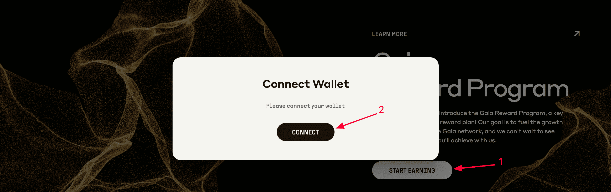
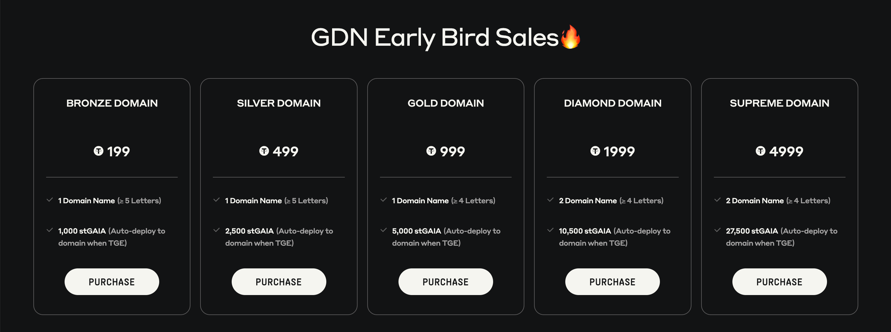

# Gaia

#### Gaia **Hakkında**


[**Twitter**](https://x.com/Gaianet_AI) **|** [**Website**](https://www.gaianet.ai/) **|** [**Discord**](https://discord.gg/pQrcbFx76N) **|** [**Docs**](https://docs.gaianet.ai/intro/)



**Gaia**, herkesin kendi tarzlarını, değerlerini, bilgilerini ve uzmanlıklarını yansıtan yapay zeka ajanlarını oluşturmasını, dağıtmasını, ölçeklendirmesini ve bunlardan gelir elde etmesini sağlayan merkeziyetsiz bir bilişim altyapısıdır.


***

GaiaNet Node

[**Node Kurulumu**](https://github.com/erdinin/gaia-node)

Gaia Ödül Programı

GaiaNet projesi, puan kazanabileceğiniz bir ödül programına sahiptir. Puanları çeşitli yollarla kazanabilirsiniz: sosyal görevleri tamamlamak, bir domain satın almak ve bir node kurmak. Bu puanlar gelecekte proje token’larına dönüştürülecektir. Ne kadar çok puan kazanırsanız, o kadar fazla ödül alırsınız!

#### **Nasıl Katılabilirsiniz?**

1. [**Siteye**](https://gaianet.ai/reward?invite_code=RyubT7) **gidin ve cüzdanınızı bağlayın.** Puan kazanmaya başlamak için **`RyubT7`**&#x6B;odunu girerek bonus alın (Bu kod ilerideki aktivitelerde de gerekecektir).\
   
2. **Basit sosyal görevleri tamamlayın.** Burada da **`RyubT7`** koduna ihtiyacınız olacak.

.png>)

3. **Mevcut domainlerden birini satın alın.** Satın aldığınız her domain için garantili olarak token kazanacaksınız.\
   

