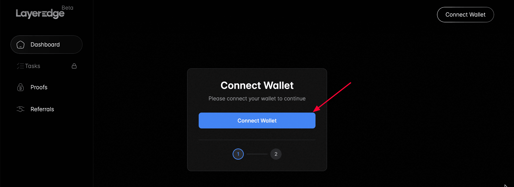
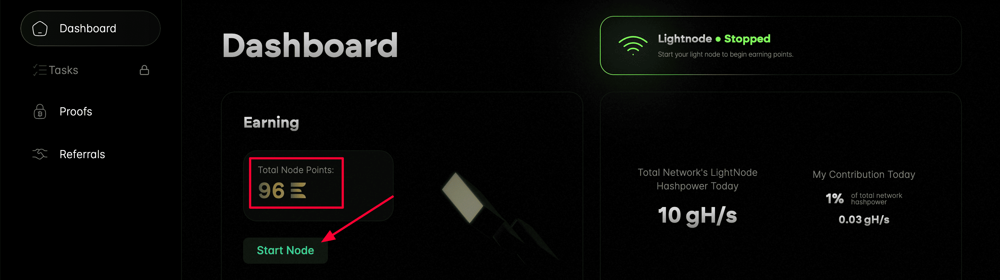
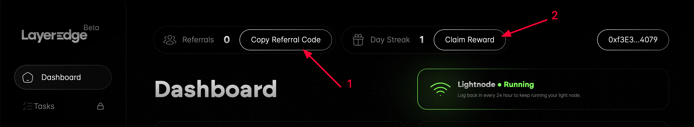
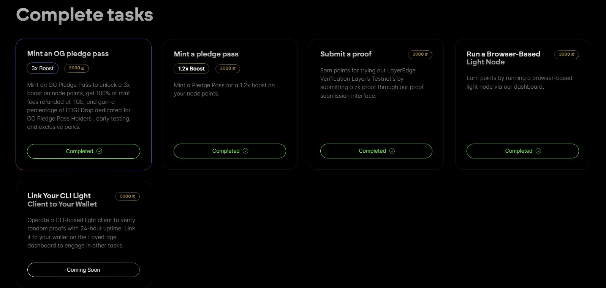

# LayerEdge

#### LayerEdge **Hakkında**


[**Twitter**](https://x.com/layeredge) **|** [**Website**](https://www.layeredge.io/) **|** [**Discord**](https://discord.com/invite/layeredge) **|** [**Docs**](https://docs.layeredge.io/) **|** [**Explorer**](https://explorer.layeredge.io/)



**LayerEdge**, Bitcoin'in güvenliğini kullanarak ZK ve BitVM teknolojileriyle blok zinciri uygulamalarını ölçeklendiren ve maliyetleri düşüren merkeziyetsiz bir ağdır.


***

Teşvikli Testnet

**LayerEdge**, ödüllerin kesinleştiği bir testnet başlattı! Tarayıcı sekmesinde bir node çalıştırarak puan kazanabiliriz. Erken kullanıcı olmak için şimdiden puan kazanmaya başlamanızı öneririz.

#### **Nasıl Katılabilirsiniz?**

1. **Siteye gidin ve cüzdanınızı bağlayın.**
2. 
3. **Erişim kodunu girin:** KrZKSP4i (çalışmazsa Twitter/X üzerinden yeni bir kod bulun)..png>)
4. **"Start Node" butonuna tıklayın.** Bu şekilde puan kazanmaya başlayacaksınız.
5. **Arkadaşlarınızı davet edin ve günlük ödülleri toplayın!**
6. **Proofs kısımından bir proof oluşturun.**.jpg>)
7. **Mint kısımından her iki NFT i de mintleyin.**
8. **Task kısımındaki tüm görevleri tamamlamaya çalışın.**

