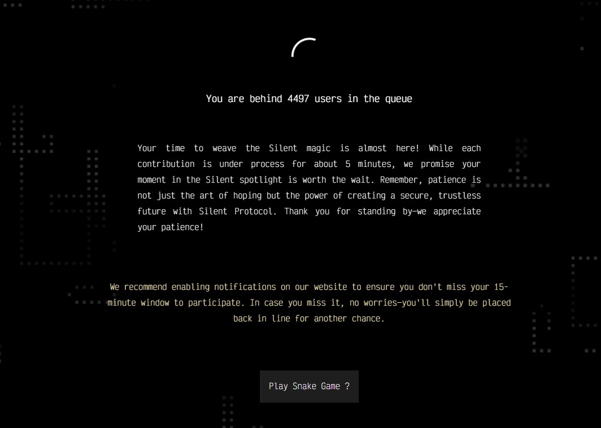

# Silent Protocol

#### Silent Protocol **Hakkında**


[**Twitter**](https://x.com/silentdao_) **|** [**Website**](https://www.silentprotocol.org/) **|** [**Blog**](https://www.silentprotocol.org/blog)



**Silent Protocol,** Ethereum üzerindeki merkeziyetsiz uygulamalara (dApp'ler) gizlilik ve ölçeklenebilirlik sağlayan modüler bir Layer 1.5 çözümüdür. EZEE teknolojisi sayesinde kullanıcıların EVM akıllı sözleşmeleriyle anonim ve güvenli şekilde etkileşime girmesine olanak tanır.


***

<strong>Trusted Setup Ceremony</strong>

1. **Silent Protocol**'ün teşvikli trusted setup ceremony si için [**link'e** ](https://ceremony.silentprotocol.org/?ref=1241086178876678145)gidin. X hesabınız ile giriş yapın.\
   .png>)
2. Contribute kısımından sıraya girin.\
   
3. Sıranız geldikten sonra sırası ile tüm devrelere Contribute edin.

