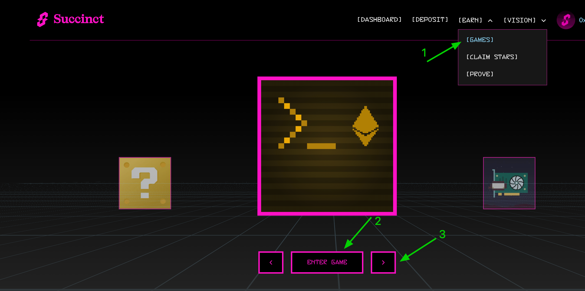

# Succinct

#### Succinct **Hakkında**


**Twitter | Website | Discord | Blog | Docs**&#x20;



​**Succinct**, sıfır bilgi (ZK) teknolojilerini kullanarak blok zinciri uygulamaları için hızlı ve güvenilir kanıtlar üreten merkeziyetsiz bir ağdır. SP1 adlı zkVM ile geliştiricilere kolay entegrasyon ve yüksek performans sunar. Polygon, Celestia ve Avail gibi projeler tarafından kullanılmaktadır.


***

<strong>Succinct Testnet</strong>

**Succinct**, testnetini başlattı! Ancak katılım oldukça zor, çünkü proje ekibi tester sayısını sınırladı. Şu an için sadece **20.000 kullanıcı** testnete erişim sağlayabiliyor. Yeni testnet slotları eklendiğinde haberdar olmak için **X/Discord duyurularını takip edin** ve kodu ilk bulanlardan biri olmaya çalışın.

#### **Nasıl Katılabilirsiniz?**

1. [**Web sitesi**](https://testnet.succinct.xyz/dashboard)**ne gidin, cüzdanınızı ve Twitter/X hesabınızı bağlayın, kodu girin ve 10 USDC yatırın.**\
   
2. **"Games" sekmesini açarak mevcut tüm oyunları oynayın.** Oynadıkça yıldız kazanırsınız. Ne kadar çok yıldız toplarsanız, o kadar iyi!\
   
3. **Kazandığınız yıldızları "Claim Stars" sekmesinden talep edin.**
4. **İlerlemenizi liderlik tablosundan takip edin.**\
   .png>)

