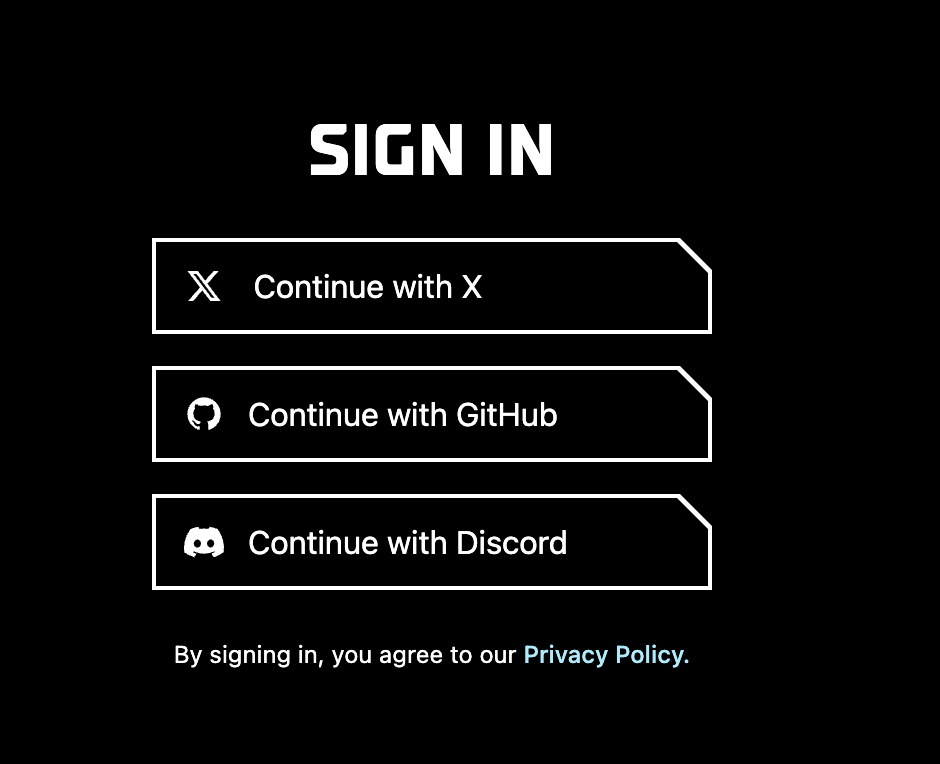
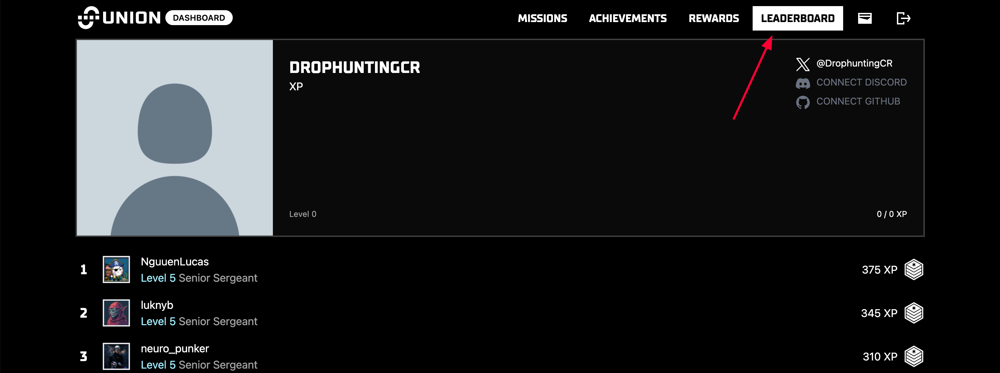

# Union

#### Union **Hakkında**


[**Twitter**](https://x.com/union_build) **|** [**Website**](https://union.build/) **|** [**Discord**](https://discord.gg/Dybq3dmvXg) **|** [**Docs**](https://docs.union.build/) **|** [**Explorer**](https://explorer.testnet-9.union.build/union)



Hiper verimli birlikte çalışabilirlik protokolü. **Union**, tüm blok zincirlerini ve rollup'ları herhangi bir ekosistem üzerinde birbirine bağlar.


***

<details>

<summary>Union Ceremony</summary>

### **Sunucu Hazırlığı ve Masaüstü Ortamı Kurulumu**

**Bu işlem, sunucunuzda bir masaüstü ortamı (XFCE) oluşturup, uzaktan erişim (RDP) ile bağlantı kurmanıza olanak tanır.**

#### **Güncelleme ve XFCE Kurulumu**

Öncelikle sisteminizi güncelleyin:

```bash
sudo apt update && sudo apt upgrade -y
```

XFCE masaüstü ortamının mevcut olup olmadığını kontrol edin:

```bash
apt-cache search xfce4
```

***

### **XRDP Kurulumu (Uzak Masaüstü Bağlantısı)**

XRDP, uzak masaüstü bağlantısı yapabilmek için gereklidir. Aşağıdaki komutları sırasıyla çalıştırarak kurulumu tamamlayın:

```bash
sudo apt install xrdp -y
sudo systemctl enable xrdp
sudo systemctl start xrdp
echo "xfce4-session" >~/.xsession
sudo ufw allow 3389/tcp
```

***

### **Tarayıcı ve Terminal Araçlarının Kurulumu**

Bu aşamada, Firefox tarayıcısını ve diğer gerekli araçları kuruyoruz.

```bash
sudo apt install firefox -y
sudo apt install screen
screen -S union
sudo apt install curl iptables build-essential git wget jq make gcc nano automake autoconf tmux htop pkg-config libssl-dev tar clang unzip -y
```

Docker’ı yükleyin ve çalıştığını doğrulayın:

```bash
bashKopyalaDüzenlesudo apt update
sudo apt install docker.io -y
docker --version
```

**Bu aşamadan sonra terminali açık bırakın ve kendi bilgisayarınıza geçin. Bir sonraki adımda, MobaXterm ile uzak masaüstü bağlantısı kuracağız.**\
**MobaXterm ile Uzak Bağlantı (RDP)**

💻 **Kendi bilgisayarınızdan sunucunuza bağlanmak için aşağıdaki adımları takip edin:**

**1️⃣ MobaXterm’i indirin:**\
**🔗** [**İndirme Linki**](https://mobaxterm.mobatek.net/download-home-edition.html)\
**2️⃣ Kurulumu tamamlayın ve çalıştırın.**\
**3️⃣ Sol üst köşeden `"Session"` butonuna tıklayın.**\
**4️⃣ Açılan pencerede "RDP" seçeneğini seçin.**

```
| **Alan**        | **Değer**          |
|---------------- |------------------|
| **Remote Host** | Sunucunun IP adresi |
| **Username**    | `root`             |
| **Port**        | `3389`             |
```

5️⃣ **"OK"** butonuna basarak bağlanın.

**Union Ceremony Kurulumu**

Artık sunucu üzerinden tarayıcıyı açarak kurulumu tamamlayabilirsiniz.

1️⃣ **Application Finder'ı açın ve Firefox'u başlatın.**\
2️⃣ Aşağıdaki linke gidin:\
🔗 [**Union Ceremony Sitesi**](https://ceremony.union.build)\
3️⃣ **Google veya GitHub ile giriş yapın.**\
4️⃣ **Linux seçeneğini seçip "Copy Command" butonuna basın.**\
5️⃣ **Terminale geri dönerek kopyalanan kodu yapıştırın ve çalıştırın.**

**Kurulum tamamlandıktan sonra `CTRL + A + D` tuşlarına basarak `screen` oturumundan çıkabilirsiniz.**&#x20;

\
**Son Adımlar ve Bekleme Süreci**

1️⃣ **MobaXterm'e geri dönün ve "Address" ile "Generate Key" kısımlarını tamamlayın.**\
2️⃣ **Generate Key işlemi tamamlandıktan sonra, Mozilla-Downloads klasöründen anahtar dosyanızı bulun.**\
3️⃣ **Her şey doğru yapıldıysa, sıra numarasıyla katılımınız tamamlanmış olacak. 🎉**

***

📌 **Bu rehber, Union Ceremony sürecini tamamlamanıza yardımcı olmak için hazırlanmıştır. Herhangi bir hata ile karşılaşırsanız, komutları kontrol edin ve adımları tekrar gözden geçirin.** 🚀

* **Daha fazla bilgi için resmi dökümantasyonu ziyaret edin: Union Docs**\


</details>

<details>

<summary>Union Dashboard</summary>

Union, **Dashboard Beta** sürümünü başlattı! Çeşitli görevleri tamamlayarak (hem sosyal hem de on-chain) **XP (puan)** kazanabiliriz. Bu puanlar ilerleyen dönemde ödüllere dönüştürülecektir.

#### **Nasıl Katılabilirsiniz?**

1. [**Web sitesi**](https://dashboard.union.build/)**ne gidin ve X hesabınızla giriş yapın.**



2. **Diğer sosyal medya hesaplarınızı ve cüzdanınızı bağlayın.**.png>)

3) **Görevleri tamamlayarak puan kazanın.**

.png>)

4. **Ayrıca başarılar elde ederek ekstra puan kazanabilirsiniz.**

.png>)

5. **Liderlik tablosundan ilerlemenizi takip edin.**



</details>

<details>

<summary>Union Testnet v2</summary>

Union, testnet’in yeni versiyonunu başlattı! Bu, mainnet lansmanından önce ağı test etmek için son fırsat. Testnet üzerindeki aktivitelerin yanı sıra, **Union Dashboard Beta**'daki görevleri tamamlamayı unutmayın (aşağıdaki rehbere göz atabilirsiniz).

#### **Nasıl Katılabilirsiniz?**

1. [**Siteye gidin**](https://app.union.build/) **ve EVM ile Cosmos cüzdanlarınızı bağlayın.**.png>)
2. **Tüm faucet’lerden test token talep edin.**\
   .png>)
3. **"Transfer" sekmesini açın ve bir test ağından diğerine token gönderin.** Testnet üzerindeki aktivitenizi artırmak için işlemleri belirli aralıklarla gerçekleştirin..png>)

</details>


<details>

<summary>Kişisel Notlar</summary>

1. **Holesky → Sepolia**
2. **Sepolia → Babylon Testnet**
3. **Babylon Testnet → Stargaze Testnet**
4. **Stargaze Testnet → Union Testnet 9**
5. **Union Testnet 9 → Holesky**
6. **Holesky → Babylon Testnet**
7. **Babylon Testnet → Union Testnet 9**
8. **Union Testnet 9 → Sepolia**
9. **Sepolia → Stargaze Testnet**
10. **Stargaze Testnet → Holesky**

Bu sıralamayla:

* Her ağdan en az bir çıkış ve giriş oluyor.
* Hiçbir ağ atlanmıyor.
* Transfer sayısı minimumda tutuluyor.

</details>
